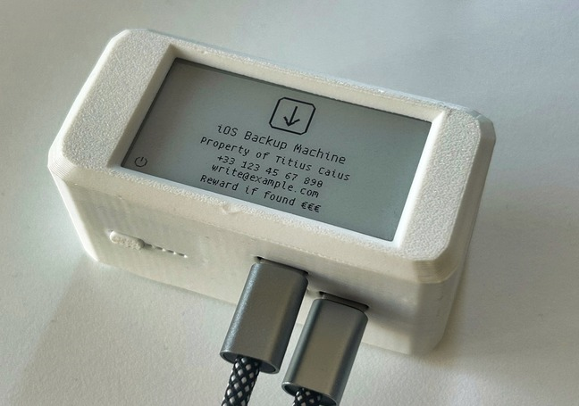
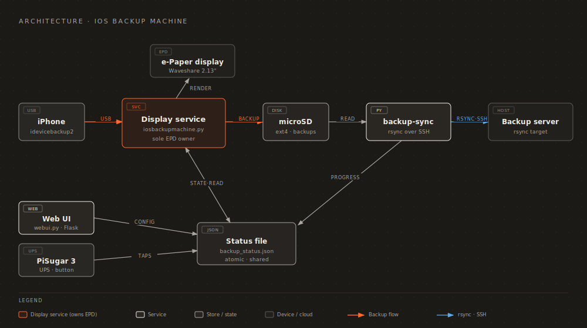
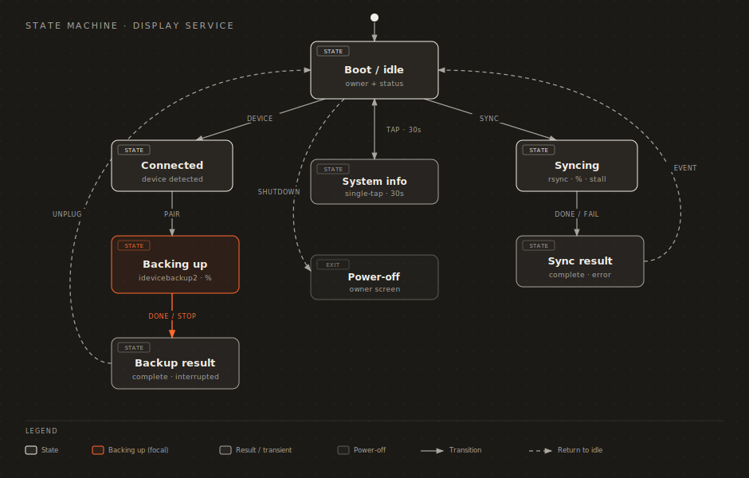

[](LICENSE)

[](https://www.python.org/downloads/release/python-3130/)
[](https://www.armbian.com/radxa-zero-3/)


[](https://radxa.com/products/zeros/zero3w/)
[](https://github.com/waveshareteam/e-Paper)
[](https://github.com/PiSugar)

[](https://github.com/giovi321/ios-backup-machine/issues)


<p align="center">
  
</p>

# iOS Backup Machine
**Offline, portable and automatic iPhone backup system** running entirely on a **Radxa Zero 3W** (an upgraded Raspberry Pi Zero W).  
When you plug in your iPhone, the system automatically runs an encrypted `idevicebackup2` backup to local storage, shows progress and messages on an e-ink display, and logs all activity locally — **no iCloud, no iTunes, you own your data.**




## Architecture

One long-running **display service** owns the e-paper and renders every screen from a shared, atomically-written status file; everything else — backup, remote sync, web UI, PiSugar button — just *writes state*. Backups land on the microSD; an optional rsync-over-SSH ships them to a remote backup server.



# Check out apple-juicer: an iOS backup explorer


If you want to inspect the backups created by this device, use **Apple Juicer**, a browser-based iOS backup explorer. Point it at your backup directory, unlock encrypted backups (password prompt), and browse parsed artifacts such as WhatsApp, Messages, (implementation ongoing: Photos, Notes, Calendar, and Contacts) with search/filter in a web UI.

- Repository: https://github.com/giovi321/apple-juicer
- Documentation: https://giovi321.github.io/apple-juicer/


## Objective
A **self-contained iOS backup appliance** with no reliance on Apple services or computers.  
All backups stay local on the microSD card and can be restored anytime using tools from [libimobiledevice](https://libimobiledevice.org).

### Key features
- **Fully automated**: starts as soon as an iPhone is plugged in.  
- **Live feedback**: e-ink shows progress, status, and errors.  
- **Secure**: backups use the iPhone's own encryption credentials.  
- **Offline and independent**: no Apple ID, no iTunes, no Internet required.
- **Solid**: file corruption is prevented by a small UPS.
- **Web UI**: configure all settings from a browser.
- **Status icons**: every e-ink screen shows power, VPN, internet, WiFi and iPhone-hotspot indicators at a glance (crossed out when inactive).
- **Multi-network WiFi**: configure several networks (each with a nickname); the device roams to whichever is in range, managed through netplan + wpa_supplicant.
- **NTP sync**: auto-syncs clock when internet is available (WiFi or USB iPhone hotspot).
- **Notifications**: webhook and MQTT alerts for backup events.
- **Remote sync**: rsync backups to a remote server over SSH (manual or auto after backup).
- **WireGuard VPN**: built-in client with encrypted config, auto-connect on boot / WiFi / iPhone, and an optional full-tunnel mode that keeps local SSH/web-UI access.
- **Credential encryption**: WireGuard and sync credentials are encrypted with AES-256-GCM. Choose between iPhone UDID (auto-decrypt when connected) or a custom password.
- **Network-aware sync**: restrict remote sync to WiFi only, a specific SSID, or iPhone USB tethering.
## How it works

### Normal operation
- Turn on the iOS Backup Machine (press once the UPS's power button and then keep pressed until all LEDs light up)
- Wait for the boot to complete (you will see a screen refresh)
- Plug in your iPhone → the backup starts automatically.
- The display:
  - prompts to unlock the phone if needed
  - shows encryption status
  - shows progress percentage
- At the end:
  - displays success confirmation and timestamp  
  - shows owner info (persistent on screen even after power off or power loss)

**In case you unplug the iPhone** the process stops safely and the screen shows the interruption timestamp.

### Interactive functions
- **Single-tap** PiSugar button: shows a system-info screen for 30 seconds (date/time, active network — WiFi / iPhone hotspot / Ethernet, IP, VPN state, last backup, last sync, SoC temperature, and disk free %), then returns to the boot screen.
- **Double-tap** PiSugar button: starts an iPhone backup (same as the web UI **Start Backup** — needs an allowed iPhone connected; works even when auto-start is off).
- **Long-press** PiSugar button: triggers remote sync to the configured server (rsync over SSH). The e-ink display shows transferred / total size, current speed, and a progress bar.
- **Boot screen**: project icon + "iOS Backup Machine" title + owner info.
- **Power-off screen**: owner info only (persists on e-paper after shutdown).

### Status icons
Every live screen (boot/idle, backup, sync, info, interrupted, complete) draws a row of status icons in the bottom-left corner: **power** (always on), **VPN**, **internet**, **WiFi**, and **iPhone hotspot**. Each network icon is crossed out with a "/" when that connection is inactive, so the device's connectivity is readable at a glance. The state is sampled in the background and never blocks or overlaps the screen text. (The power-off owner screen omits the row.)

### UPS integration
- **Battery protection**: backup stops cleanly if battery <30%.  
- **Safe shutdown**: power loss or UPS switch-off triggers graceful shutdown.  
- Prevents data corruption during unexpected disconnections.

### General behavior
- Errors appear directly on the display.  
- Logs persist under `/var/lib/iosbackupmachine/` (not the volatile zram `/var/log`).  
- On boot, owner info is displayed.  
- When idle, the screen shows last backup result, timestamp, disk usage, and owner info.

### Display architecture
The e-paper display has a **single owner**: the always-on `iosbackupmachine.service` daemon. It holds the EPD for the whole uptime and renders every screen — boot/idle, backup progress, sync progress, single-tap system info, unplug/interrupted, and the power-off owner screen — from state. Everything else just *writes state* and never touches the display:

- **Backup** runs inside the daemon and detects an iPhone by polling (no udev restart, which previously tore down the display owner mid-render).
- **Remote sync** (`backup-sync.py`) writes progress to the status file; the daemon draws it.
- **Single-tap** (PiSugar) is handled by the daemon's button listener.
- **Unplug** (udev) only stops a running `idevicebackup2`; the daemon renders the interrupted screen.
- **Shutdown** sends the daemon `SIGTERM`; it paints the owner screen and sleeps the panel so the image persists after power-off.
- **Web UI** Start/Stop Backup drop small sentinel files the daemon consumes, instead of restarting the service.

This is what fixed the recurring SPI-bus conflicts and "screen not updating" bugs: only one process ever opens the EPD.

The daemon renders these screens, with one full refresh on every screen-type transition (and partial refresh for animated progress):




## Hardware

| Component | Purpose | Rationale |
|------------|----------|-----------|
| **Radxa Zero 3W (8GB eMMC)** | Main controller | eMMC is faster and more reliable than a microSD |
| **Waveshare 2.13" e-Paper HAT V4 (250×122)** | Status display | Persistent output, readable, low power |
| **PiSugar 3** | UPS and safe shutdown | Prevents corruption on power loss |
| **MicroSD card** | Backup storage | Dedicated storage separate from OS |
| **3D printed case** | --- | Based on the design by PiSugar and edited for this purpose |


## Software

| Component | Role |
|------------|------|
| **Armbian (Trixie)** | Base OS |
| **Python 3.13** | Runtime for backup and display scripts |
| **libimobiledevice** | iPhone communication (`idevicebackup2`, `idevicepair`) |
| **udev + systemd** | Automation and event handling |
| **netplan + systemd-networkd + wpa_supplicant** | WiFi management (no NetworkManager) |
| **Flask** | Web UI for settings |
| **WireGuard** | Optional VPN client (auto-connect, optional full tunnel) |


## Directory layout

**Repository** (cloned to `/root/ios-backup-machine/`):
```
├── install.sh / update.sh / uninstall.sh
├── requirements.txt
├── app/                             # Python source files
│   ├── iosbackupmachine.py          # Always-on display daemon + backup logic (owns the EPD)
│   ├── webui.py                     # Flask web UI
│   ├── backup-sync.py               # Double-tap / web UI: remote sync via rsync
│   ├── config_schema.py             # Config defaults, versioned migration, atomic save
│   ├── power.py                     # PiSugar UPS battery reader (power-aware sync)
│   ├── ntp-sync.py, notifications.py, netutil.py
│   ├── wg_crypto.py, wg_manager.py  # WireGuard encryption, management & routing
│   ├── wifi_manager.py              # WiFi config via netplan / wpa_supplicant
│   ├── sync_crypto.py, sync_manager.py  # Remote sync encryption & execution
│   ├── epdconfig.py                 # E-paper hardware config
│   ├── webui_templates/             # HTML templates
│   └── webui_static/                # Icon, favicon
├── config/                          # Configuration templates
│   ├── config.yaml.example, [pisugar]config.json
│   ├── armbianEnv.txt, 90-iosbackupmachine.rules, 99-wg-autoconnect
├── services/                        # Systemd service files (7)
├── scripts/                         # Shell scripts (launcher, shutdown, unplug, wg-autoconnect)
└── assets/                          # Font, 3D case STL, images, diagrams
```

**Installed** (to `/root/iosbackupmachine/` — flat):
```
├── *.py                             # All Python files (co-located for imports)
├── *.sh                             # Shell scripts
├── config.yaml                      # User config (never overwritten on update)
├── UbuntuMono-Regular.ttf           # Display font
├── webui_templates/ / webui_static/ # Web UI assets
└── .installed_version               # Version tracking
```

## Configuration

Edit `/root/iosbackupmachine/config.yaml` directly or use the **Web UI** at `http://<device-ip>:8080`.

All settings are stored in a single YAML file. The web UI reads and writes to this file directly.

```yaml
# --- Core backup settings ---
backup_dir: /media/iosbackup/
marker_file: .foldermarker
disk_device: /dev/mmcblk1
orientation: landscape_right
font_path: "/root/iosbackupmachine/UbuntuMono-Regular.ttf"
owner_lines:
  - "Property of Titius Caius"
  - "+33 123 456 7890"
  - "write@titiuscaius.com"
  - "Reward if found €€€"
error_codes:
  "100": "Snapshot failure at path"
  # ...

# --- Authentication ---
auth:
  password_hash: ""   # auto-managed; set via web UI

# --- Backup behavior ---
backup:
  auto_start: true              # start backup when iPhone is plugged in
  notify_on_rejected: true      # notify when a non-allowed device is connected

# --- Backup encryption ---
backup_encryption:
  encryption_confirmed: false   # set true once encryption verified enabled

# --- Device filter ---
device_filter:
  enabled: false
  allowed_devices:              # list of {udid, name} dicts
    # - udid: "00008030-001A..."
    #   name: "John's iPhone 15"

# --- WiFi ---
# Configure one or more networks; the device joins whichever is in range.
# Managed via netplan + wpa_supplicant (no NetworkManager). ssid/password are the
# legacy single-network fields, mirrored to networks[0] for back-compat.
wifi:
  enabled: false
  ssid: ""
  password: ""
  networks: []
  #  - nickname: "Home"
  #    ssid: "HomeNetwork"
  #    password: "secret"
  #  - nickname: "Office"
  #    ssid: "CorpWiFi"
  #    password: "another-secret"

# --- NTP time sync ---
ntp:
  enabled: true
  servers:
    - "pool.ntp.org"
    - "time.google.com"

# --- Web UI ---
webui:
  enabled: true
  port: 8080
  bind_interfaces:
    - "all"          # options: all, wifi, usb_iphone
  secret_key: ""     # auto-generated on first start

# --- Notifications ---
notifications:
  webhook:
    enabled: false
    url: ""
    events: [backup_complete, backup_error]
  mqtt:
    enabled: false
    broker: ""
    port: 1883
    username: ""
    password: ""
    topic_prefix: "iosbackupmachine"
    events: [backup_complete, backup_error]

# --- WireGuard client ---
wireguard:
  enabled: false
  interface_name: "wg0"
  auto_connect: false           # connect automatically
  auto_connect_on: [iphone]     # triggers: iphone, wifi, boot (combinable)
  full_tunnel: false            # route ALL traffic through the VPN (see WireGuard VPN)
```

**Notes**
- The `.foldermarker` file confirms the SD card is mounted correctly.  
- Edit `owner_lines` to customize contact info shown on the e-ink display.  
- `disk_device` allows monitoring disk usage after backup.
- Config is written **atomically** (tmp + `fsync` + rename), so a power loss mid-save can't truncate `config.yaml`.
- `config_version` is managed automatically: on update, a single versioned migration step fills new defaults without overwriting your values. Don't edit it by hand.
- **WireGuard config** is stored separately in `/root/iosbackupmachine/wireguard.enc`, encrypted with the iPhone's UUID (or a custom passphrase).
- **`secret_key`** is auto-generated on first start and persisted to `config.yaml`. Never needs manual editing.


## Installation

### 1. Flash Armbian on the Radxa Zero 3W
Follow the [Radxa Zero 3W official guide](https://docs.radxa.com/en/zero/zero3/low-level-dev/install-os-on-emmc).  
In short:
```bash
apt install rkdeveloptool
rkdeveloptool db rk356x_spl_loader_ddr1056_v1.12.109_no_check_todly.bin
xz -d Armbian_community_25.11.0-trunk.334_Radxa-zero3_trixie_vendor_6.1.115_minimal.img.xz
rkdeveloptool wl 0 Armbian_community_25.11.0-trunk.334_Radxa-zero3_trixie_vendor_6.1.115_minimal.img
rkdeveloptool rd
```

### 2. Automated install (recommended)

After flashing Armbian and logging in as root, run:
```bash
cd /root
git clone https://github.com/giovi321/ios-backup-machine.git
bash ios-backup-machine/install.sh
```

The install script automatically performs all remaining setup steps:
- Enables I2C and SPI overlays in `/boot/armbianEnv.txt`
- Installs system packages (`libimobiledevice`, `python3`, `wireguard-tools`, etc.)
- Creates a Python virtual environment and installs dependencies
- Clones and links the Waveshare e-Paper driver
- Copies application files to `/root/iosbackupmachine/`
- Migrates config (merges new defaults without overwriting existing settings)
- Installs systemd services and udev rules
- Prepares the backup storage directory
- Downloads and configures PiSugar UPS
- Runs a post-install health check
- Prompts to reboot when overlay changes were made or a release sets a reboot flag (so the always-on display daemon reloads)

After the script finishes, open the web UI at `http://<device-ip>:8080` to complete the first-start wizard.

### 3. Updating

**From the web UI**: go to **Tools > Update**, click "Check for Updates", then "Install Update".

**From SSH**:
```bash
bash /root/ios-backup-machine/update.sh
```

The update process:
- Stops all services before touching files
- Backs up current installation (keeps last 5 backups in `/root/iosbackupmachine-backups/`)
- Pulls latest code from GitHub
- Migrates config (adds new settings without overwriting your values)
- Runs the installer with a post-install health check
- Restarts services (and prompts for a reboot when the release requires one)

If you prefer, you can install manually.
<details>
<summary><strong>Manual installation (step-by-step reference)</strong></summary>

If you prefer to install manually, follow these steps after flashing Armbian:

### 2. Enable I2C and SPI
Edit `/boot/armbianEnv.txt`:
```
overlays=rk3568-spi3-m1-cs0-spidev rk3568-i2c3-m0
overlay_prefix=rk35xx
```
Reboot.

### 3. Install dependencies
```bash
apt update
apt install -y python3 python3-venv python3-pil python3-periphery \
  libimobiledevice-1.0-6 libimobiledevice-utils usbmuxd \
  wireguard-tools iptables sshpass rsync netcat-traditional \
  iw wireless-tools git
```
WiFi is managed through the OS's existing **netplan + systemd-networkd + wpa_supplicant**
stack (the device has no NetworkManager); `iw` / `wireless-tools` are used to read the
connected SSID, and `iptables` is used by the WireGuard full-tunnel routing exception.

### 4. Create Python virtual environment
```bash
python3 -m venv /root/iosbackupmachine
source /root/iosbackupmachine/bin/activate
pip install -r /root/ios-backup-machine/requirements.txt
deactivate
```

### 5. Clone repositories and install drivers
```bash
cd /root
git clone https://github.com/waveshareteam/e-Paper.git
git clone https://github.com/giovi321/ios-backup-machine.git
cp ios-backup-machine/epdconfig.py e-Paper/RaspberryPi_JetsonNano/python/lib/waveshare_epd/
```

Link the driver into the venv (adjust Python version if needed):
```bash
ln -s /root/e-Paper/RaspberryPi_JetsonNano/python/lib/waveshare_epd   /root/iosbackupmachine/lib/python3.13/site-packages/
```

### 6. Install systemd and udev integrations
```bash
cp ios-backup-machine/*.rules /etc/udev/rules.d/
cp ios-backup-machine/*.service /etc/systemd/system/
systemctl daemon-reload
systemctl enable iosbackupmachine.service   # always-on display daemon
systemctl enable webui.service
systemctl enable ntp-sync.service
udevadm control --reload-rules
```

### 7. Prepare backup storage
```bash
mkdir -p /media/iosbackup
touch /media/iosbackup/.foldermarker
```

### 8. Configure PiSugar UPS
Install from official script and add out config file:
```bash
wget https://cdn.pisugar.com/release/pisugar-power-manager.sh
bash pisugar-power-manager.sh -c release
rm /etc/pisugar-server/config.json
cp /root/ios-backup-machine/[pisugar]config.json /etc/pisugar-server/config.json
```
Set the time of the RTC based on the current time of the Radxa Zero:
```bash
apt install netcat-traditional
echo "rtc_pi2rtc" | nc -q 1 127.0.0.1 8423
```
Automatically set the time of the Radxa Zero based on the RTC time at every boot
```bash
systemctl enable rtc-sync.service
```

</details>

## First run

1. Open the web UI at `http://<device-ip>:8080`. The **first-start wizard** will guide you through owner info, backup directory, encryption password, display orientation, and optional web UI password.
2. **Backup encryption**: during setup (or later via **Encryption** in the sidebar), enter a password with your iPhone connected and unlocked. The password is sent directly to the iPhone and **never stored on this device** — write it down.
3. If no iPhone is connected during setup, skip the encryption step and visit the **Encryption** page later when your iPhone is plugged in.
4. Plug in your iPhone, unlock it, and tap **Trust** when prompted.
5. The first backup runs (this takes a long time depending on device storage). All subsequent backups are incremental and much faster.
6. **If the first backup is interrupted**: encryption (if enabled) remains active on the iPhone. The next backup attempt will proceed normally — no data is lost.


## Restoring a backup
To restore a backup simply plug your iOS device in a computer, plug the microSD card in the same computer and run:
```
idevicebackup2 restore --password <your backup password> /media/sdcard/iosbackup/
```

## Logs
Logs are stored on the rootfs under `/var/lib/iosbackupmachine/`, so they survive
reboots and power loss. They are deliberately kept off `/var/log`, which on this
Armbian image is a zram RAM disk (`armbian-ramlog`) that loses anything not yet
synced to disk when the device is cut abruptly — the exact failure mode of a
power-loss shutdown. Volatile runtime state (`backup_status.json`,
`start_requested`, `stop_requested`) stays on `/var/log/iosbackupmachine/`, where
it belongs: it is rewritten constantly and regenerated every run, so keeping it in
RAM avoids SD-card wear.

Each run creates a file:
```
backup-YYYYMMDD-HHMMSS.log
sync-YYYYMMDD-HHMMSS.log
```
Retention is managed by the app, not logrotate: the newest 50 backup logs and 50
sync logs are kept, and anything older than 90 days is pruned (override with the
`IOSBACKUP_LOG_KEEP` / `IOSBACKUP_LOG_MAX_AGE_DAYS` env vars). The continuous
append logs (`ntp-sync.log`, `autostart.log`, `update.log`) are size-capped by
logrotate; `webui.log` self-rotates.

## Web UI

Access the web interface at `http://<device-ip>:8080`.

### First-start wizard

On the very first boot (when owner info has not been configured), the web UI automatically shows a **guided setup wizard** that walks you through:
1. **Owner information** — displayed on the e-ink screen when idle
2. **WiFi** (optional) — connect to a wireless network for NTP sync, notifications, and remote access
3. **Date & Time** — set the system clock manually or enable automatic NTP synchronization
4. **Backup directory** — where backups are stored
5. **Backup encryption** — set directly on your iPhone (password is never stored on this device)
6. **Device filter** (optional) — restrict which iPhones can trigger a backup; auto-detects connected device
7. **Notifications** (optional) — webhook and MQTT alerts for backup events
8. **Display orientation** — landscape left or right
9. **Web UI password** (optional) — protect the settings interface

The Flask session `secret_key` is automatically generated on first start and saved to `config.yaml` — no manual configuration needed.

### Dashboard

The dashboard shows two live status cards and auto-refreshes every 5 seconds:

- **Backup Status** with inline Start Backup / Stop Backup buttons. Shows percentage and encryption status while a backup is running; idle while a remote sync is in progress.
- **Remote Sync Status** with inline Sync Now (or Cancel Sync, when active) and a Configure shortcut when sync is disabled. Shows percent, transferred / total size, current speed, and stall / scanning hints.

### Settings pages

- **Backup Settings**: auto-start toggle, notification on rejected devices
- **Device Filter**: allow only specific iPhones by UDID (auto-detect connected device or manual entry)
- **Encryption**: enable/change backup encryption on connected iPhone (password never stored)
- **General**: backup directory, display orientation, owner information
- **Date & Time**: manual date setting, NTP sync configuration
- **WiFi**: enable/disable and configure one or more networks (each with an optional nickname); the device joins whichever is in range. Shows the connected SSID + nickname, and a **Scan & connect** button forces a rescan and connects to any saved network in range
- **Notifications**: webhook URLs and MQTT broker settings (separate test buttons for webhook, MQTT, and both)
- **WireGuard**: upload and encrypt VPN config, start/stop interface, auto-connect triggers (iPhone / WiFi / boot), and a full-tunnel toggle
- **Remote Sync**: enable, configure SSH credentials (encrypted), test connection, trigger sync, set network restrictions
- **Web UI**: select which network interfaces the web UI listens on
- **Password**: protect the web UI with a password (set, change, or remove)
- **Logs**: browse and view backup log files directly from the browser, with separate live-tail links for the most recent backup and the most recent sync log

### Authentication

By default the web UI has no password (or you can set one during the first-start wizard).  
Once set, all pages require login. The password is hashed (SHA-256 + salt) and stored in `config.yaml`.  
You can change or remove the password at any time from the **Password** page.

## Credential Encryption

WireGuard and remote sync credentials are encrypted using AES-256-GCM with a key derived via PBKDF2 (100,000 iterations).

**Two passphrase modes** (configurable in WireGuard settings):

| Mode | Passphrase | Auto-start | Security |
|------|-----------|------------|----------|
| **iPhone UDID** (default) | iPhone's unique device ID | Yes, when iPhone is connected | Protected if device stolen without iPhone |
| **Custom password** | User-chosen password | No, manual entry required | Protected by password strength |

- **CLI**: `python3 wg_crypto.py decrypt` (auto-uses UDID if available, else prompts)
- Encrypted files: `wireguard.enc`, `sync.enc` in the install directory

## WiFi

WiFi is managed through the OS's **netplan + systemd-networkd + wpa_supplicant** stack — the device has no NetworkManager. Saving networks in the web UI writes a managed netplan drop-in (`/etc/netplan/90-iosbackup-wifi.yaml`) and applies it; the OS's own netplan files are left untouched.

- **Multiple networks**: configure several networks, each with an optional **nickname**. `wpa_supplicant` associates to whichever configured network is in range, so the device roams automatically as you move between them.
- **iPhone-hotspot preference**: the WiFi route is given a higher metric than the iPhone USB tether's, so the **iPhone hotspot is used when it's plugged in** and **WiFi takes over automatically when it's unplugged** — and the WiFi connection is no longer dropped as the iPhone connects/disconnects.
- **Scan & connect**: the WiFi settings page has a button that forces a rescan and connects to any saved network in range.
- **Status**: the dashboard, the e-ink info screen, and `/api/status` show the connected SSID and its nickname (read via `iw` / `iwgetid` / `wpa_cli`).
- The legacy single `ssid`/`password` fields are migrated into `networks[0]` automatically.

## WireGuard VPN

A built-in WireGuard client. The config is uploaded through the web UI and stored **encrypted** (`wireguard.enc`); it's decrypted with the connected iPhone's serial or a custom passphrase (see [Credential Encryption](#credential-encryption)).

- **Auto-connect**: enable *Auto-connect* and pick the triggers — **iPhone plugged in**, **WiFi available**, and/or **on boot** (combinable). A background reconciler in the display daemon brings the tunnel up as soon as a selected connection source appears, so it connects reliably even after errors, reconnects, or a hotspot toggled on after the phone was already plugged in — not just on a one-off boot event. It also verifies the tunnel actually **handshakes**, not just that the `wg0` interface exists: if the interface comes up but no handshake completes within a grace window (endpoint unreachable, or the clock not yet NTP-synced so the peer rejects the handshake), it tears it down and reconnects. In `udid` decryption mode the tunnel can only come up while the iPhone is readable, since the config is decrypted with the iPhone serial; the persisted WireGuard log lines show `Cannot decrypt: no iPhone connected` when it is waiting for the phone.
- **Full tunnel** (optional): routes **all** traffic through the VPN, re-applied on every connect. Use this when the **remote sync server's IP overlaps the local WiFi subnet** — a plain `wg-quick` full tunnel would send that same-subnet traffic out the WiFi instead of the tunnel. Requires `AllowedIPs = 0.0.0.0/0` in the WireGuard config.
  - **Local access is preserved**: even with full tunnel on, **SSH and the web UI stay reachable from the local network**. Replies to connections that arrive on a non-VPN interface are kept off the tunnel via connection-mark policy routing (iptables `CONNMARK` + an `ip rule`), while everything the device *initiates* still goes through the VPN.
- Status is shown on the dashboard, the e-ink VPN icon, and `/api/status`.

## Remote Sync

Sync backups to a remote server via **rsync over SSH**. Supports SSH key and password authentication.

- **Manual sync**: long-press the PiSugar button, or click **Sync Now** on the web UI dashboard or Remote Sync settings page.
- **Auto-sync**: optionally trigger after each successful backup.
- **Network restrictions**: limit sync to WiFi only, a specific SSID, or iPhone USB tethering.
- **Clear connection errors**: if a sync can't reach the server, a pre-flight check reports the actual cause on both the e-ink and the dashboard — *No network connection*, *VPN not connected*, *No internet connection*, or *Sync server unreachable* — instead of a cryptic rsync exit code.
- **Progress display**: the e-paper screen and the web dashboard show transferred / total size, current speed, percentage, and a progress bar. Sizes auto-scale (KB / MB / GB / TB). During the initial file-list scan (rsync `--no-inc-recursive`) you see "Building file list (Xs)" instead of fake progress.
- **Stall detection**: if rsync produces no output for **2 minutes**, the dashboard shows a yellow "Stalled" badge and the e-ink switches to "Sync STALLED". After **15 minutes** without progress the sync is auto-aborted with a sync_error.
- **Cancel button**: while a sync is in progress, a Cancel Sync button appears on the dashboard and Remote Sync settings page. It kills `rsync` + `backup-sync.py` immediately and reports `Cancelled by user.`. The end-state (complete / failed / cancelled) stays on the e-ink until another event (new sync, backup start, service restart).
- **SSH keepalive**: `ServerAliveInterval=30 / CountMax=3` detects dead TCP connections in ~90 s.
- **Resumable across reboots**: rsync runs with `--partial --partial-dir=.rsync-partial`, so a reboot (or power loss) mid-sync resumes from where it stopped instead of restarting from zero. Incomplete files live in `.rsync-partial/` on the remote.
- **Power-aware**: a sync won't start — and an in-progress sync auto-aborts — when the battery is below `sync.min_battery_percent` (default **35%**) and the device isn't charging, so a long transfer isn't cut mid-way by PiSugar's 30% auto-shutdown. The aborted transfer resumes on the next run (see above). The threshold is tunable in `config.yaml`; battery is read fail-open (if the UPS can't be reached, the sync proceeds).
- Configure via web UI under **Remote Sync**.

**Remote server requirement**: `rsync` must be installed on the receiving server (`sudo apt install rsync`).

## Health endpoint

`GET /api/health` returns a JSON snapshot for external monitoring (Uptime Kuma, Home Assistant, a cron check, etc.). It is **login-exempt** and contains no secrets (no owner info, credentials, or keys):

```json
{
  "status": "ok",                       // ok | warning | error (rollup)
  "warnings": [],
  "version": "4.3.0",
  "time": "2026-05-30T11:13:31",
  "services": { "iosbackupmachine": "active", "webui": "active",
                "pisugar-server": "active", "usbmuxd": "active" },
  "disk":     { "root": {...}, "backup": { "free": "...", "percent": 42.0 } },
  "battery":  { "percent": 62.0, "charging": false },
  "network":  { "active_ip": "192.168.1.50", "interface": "wifi",
                "wifi_ssid": "HomeNetwork", "wifi_nickname": "Home",
                "internet": true, "wireguard": {...} },
  "backup":   { "state": "complete", "last_backup_time": "..." },
  "sync":     { "state": "sync_complete", "timestamp": "..." }
}
```

`status` rolls up to `error` (failed service / backup disk ≥95%), `warning` (low battery, no internet, last backup errored), or `ok`.

## Notifications

Backup and sync events can be sent via **webhook** (JSON POST) and/or **MQTT**.  
Supported events: `backup_start`, `backup_complete`, `backup_error`, `sync_start`, `sync_complete`, `sync_error`, `device_connected`, `device_disconnected`, `device_rejected`.

Configure via the web UI or directly in `config.yaml`.

## Device Filter

Restrict which iPhones can trigger a backup:
1. Enable the filter in **Device Filter** settings.
2. Add devices by connecting an iPhone and clicking "Add connected device", or enter a UDID manually.
3. When a non-allowed device is plugged in, backup is blocked and a notification is sent (configurable).

When the filter is disabled (default), any iPhone triggers a backup.

## To-do

Things I want to get to. PRs welcome. _(The architecture and reliability items — single e-paper owner, atomic config + migrations, `/api/health`, resumable & power-aware sync, tests/CI — are done; see [Architecture](#architecture), [Configuration](#configuration), and [Development](#development).)_

### Features
- **Multiple sync destinations.** Today there's exactly one remote. Allow a list and let the user pick which one runs on auto-sync vs. manual.
- **Local backup encryption at rest.** iOS encrypts the backup payload, but Manifest and metadata are still readable on the microSD. Optional LUKS or encfs over the backup directory.
- **Backup retention policy.** Auto-prune oldest backups by count or age once the disk crosses a threshold.
- **Per-device names in the UI.** Show the iPhone's marketing name ("John's iPhone 15") instead of the UDID everywhere, decrypted from the device on first contact.

### UX
- **Dark mode** for the web UI.
- **Mobile layout.** Most cards work on a phone but the log viewer and settings forms could use a pass.
- **Live sync log on the dashboard.** Last 5–10 lines under the Remote Sync card instead of having to open `/logs`.
- **First-start wizard pass.** Sync credentials aren't part of the wizard — add them.

### Docs
- Photo walkthrough of the hardware assembly (case, HAT alignment, PiSugar wiring).
- Troubleshooting section for the things I keep answering in issues (SSH key with Windows line endings, missing rsync on the remote, EPD stuck after power loss).

## Development

Unit tests cover the hardware-independent core (rsync progress parsing, sync/WireGuard
credential crypto round-trips, the config schema/migration including the WiFi-networks
migration, the WiFi netplan generator, and the power-aware battery logic). They import the
flat app modules via a path shim and need no e-paper hardware.

```bash
pip install -r requirements.txt -r requirements-dev.txt
pytest
```

CI (GitHub Actions, `.github/workflows/ci.yml`) runs the suite on Python 3.11–3.13 on every
push and pull request.

## License
MIT License  
Includes code adapted from Waveshare’s [e-Paper library](https://github.com/waveshareteam/e-Paper).
